\begin{center}
\large
— Hakai Institute Juvenile Salmon Program —
\end{center}


```
## 
Downloading: 1.4 kB     
Downloading: 1.4 kB     
Downloading: 2.2 kB     
Downloading: 2.2 kB     
Downloading: 3.5 kB     
Downloading: 3.5 kB     
Downloading: 4.9 kB     
Downloading: 4.9 kB     
Downloading: 6.3 kB     
Downloading: 6.3 kB     
Downloading: 6.3 kB     
Downloading: 6.3 kB     
Downloading: 7.5 kB     
Downloading: 7.5 kB     
Downloading: 8 kB     
Downloading: 8 kB     
Downloading: 8 kB     
Downloading: 8 kB     
Downloading: 8 kB     
Downloading: 8 kB     
Downloading: 8 kB     
Downloading: 8 kB     
Downloading: 1.2 kB     
Downloading: 1.2 kB     
Downloading: 2.6 kB     
Downloading: 2.6 kB     
Downloading: 4 kB     
Downloading: 4 kB     
Downloading: 4.1 kB     
Downloading: 4.1 kB     
Downloading: 4.4 kB     
Downloading: 4.4 kB     
Downloading: 5.7 kB     
Downloading: 5.7 kB     
Downloading: 6.3 kB     
Downloading: 6.3 kB     
Downloading: 7.5 kB     
Downloading: 7.5 kB     
Downloading: 8.3 kB     
Downloading: 8.3 kB     
Downloading: 9 kB     
Downloading: 9 kB     
Downloading: 9 kB     
Downloading: 9 kB     
Downloading: 9 kB     
Downloading: 9 kB     
Downloading: 9 kB     
Downloading: 9 kB
```


## Aim 

To provide regular in-season summaries of juvenile Fraser salmon migration catch statistics, health indices, and oceanographic conditions in the northern Strait of Georgia to Johnstone Strait region. 

## Background

The Hakai Institute Juvenile Salmon Program was launched in the spring of 2015 in a collaborative partnership with UBC, SFU, Salmon Coast, Pacific Salmon Foundation, and DFO. The program operates in the Discovery Islands and Johnstone Strait (Figure 1) and thus provides information on the health of juvenile Fraser River salmon after passage through: 

1) Strait of Georgia – stratified high plankton biomass zone; and 

2) Discovery Islands & Johnstone Strait – highly-mixed low-plankton-biomass zone, and area of high wild-farmed fish interactions.

## Program Objectives

1) Determine migration timing and pathways; 

2) Migration habitat mapping - oceanographic conditions along the migration route;

3) Understand the dynamics of the plankton food-webs that underpin juvenile salmon growth and
health;

4) Understand parasite and pathogen infection dynamics and their impact on juvenile salmon growth and
health.

## Key Parameters Reported
* Catch Statistics
* Parasite Loads
* Sockeye Length and Weight
* Oceanographic Conditions


The following plots are subject to change as the underlying data are preliminary and subject to further quality assurance. 

We are endeavouring to provide useful information for the entire salmon research community. As such we welcome any feedback. Please direct questions or comments to Brian Hunt (B.Hunt@oceans.ubc.ca) and/or Brett Johnson (Brett.Johnson@hakai.org). 

__Report prepared by:__ Brett Johnson, Carly Janusson, Julian Gan, and Brian Hunt  
__Updated:__ 2017-08-01  

## Catch Statistics
### Cumulative Abundance of all Species
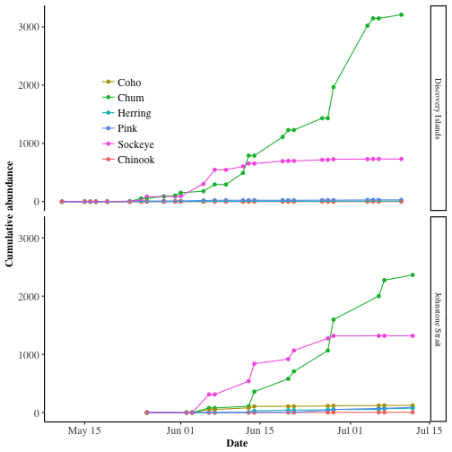

### Cumulative Abundance of Sockeye by Region
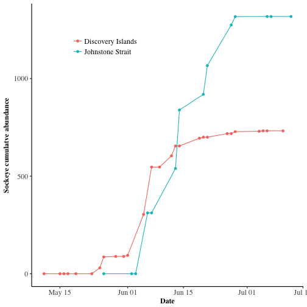

### Sockeye Catch Per Unit Effort

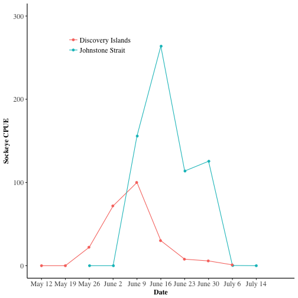

\newpage

## Parasite Loads 

### Definitions[^1] 

_Prevalence_: Number of individuals of a host species infected with a particular parasite species ÷ Number of hosts examined. 

_Mean Infection Intensity_: Total number of individuals
of a particular parasite species
in a sample of a host species ÷ Number
of infected individuals of the host
species in the sample (= Mean number
of individuals of a particular parasite
species per infected host in a sample). 

_Abundance_: The total number of individuals of a particular parasite species in a sample of hosts ÷ Total number of individuals of the host species in the sample.

[^1]: Margolis, L., Esch, G.W., Holmes, J.C., Kuris, A.M. and Schad, G.A. (1982). The use of ecological terms in parasitology: report of an ad hoc committee of the American Society of Parasitologists. J. Parasitol. 68:131–133.

### Sea Lice Prevalence


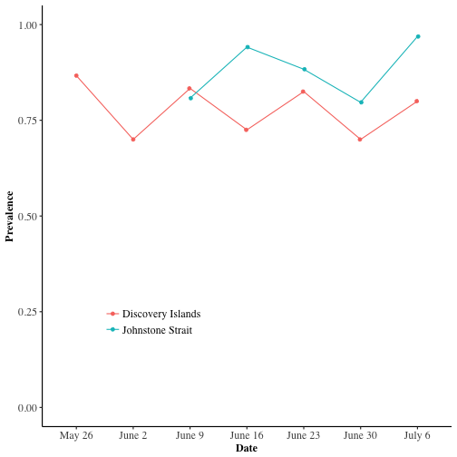

 
\newpage

### Sea Lice Infection Abundance

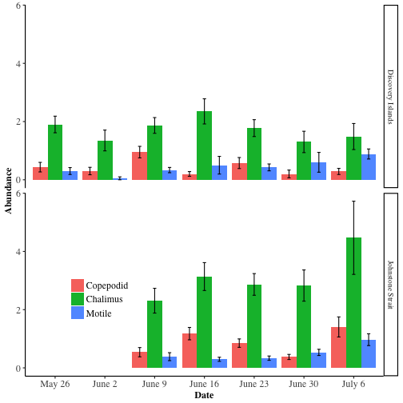


### Motile Infection Abundance by Species

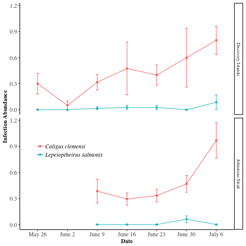

\newpage


### Sea Lice Infection Intensity

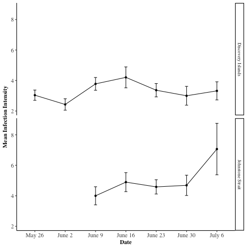

\newpage

#### Motile _Caligus clemensi_ Infection Intensity 
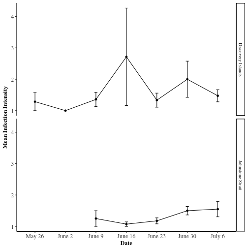

\newpage

#### Motile _Lepeoptheirus salmonis_ Infection Intensity


\newpage


## Fish Length and Weight
### Sockeye Length
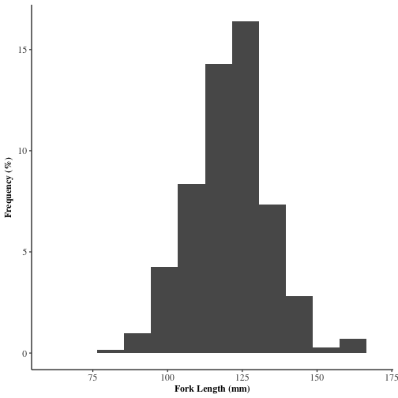

### Sockeye Weight
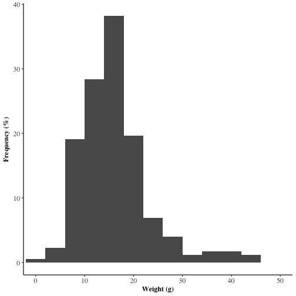


## Oceanographic Conditions
### Chlorophyll a

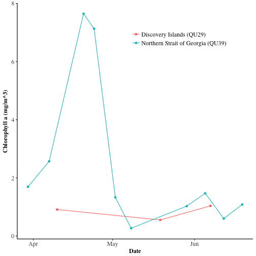

### Temperature 

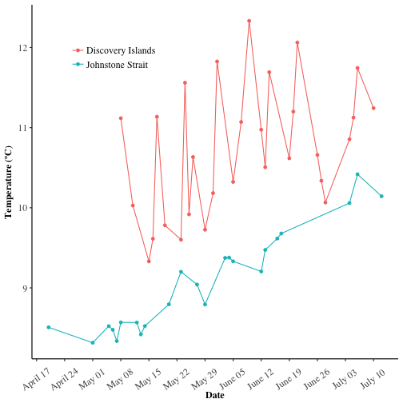


## Highlights
* Sampling has finished for the 2017 smolt migration
* Sockeye arrived later in 2017 than in 2015 and 2016
* Sockeye finished passing through the study region at a similar date as in 2015 and 2016
* Chum abundance is high in 2017
* Very few _Lep._ sea lice
